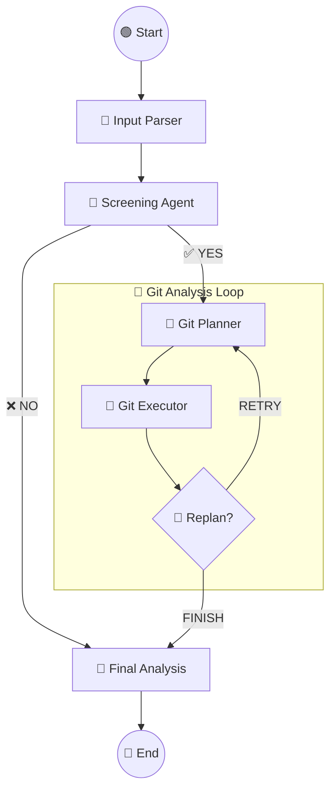

# 🤖 Multi-Agent Resume Analyzer
 
A sophisticated **Multi-Agent System** designed to automate the screening process. 
The system evaluates candidates by analyzing their **Resume text** and performing a deep-dive technical audit of their **GitHub repositories**.

## 🚀 Overview

This project uses **LangGraph** to orchestrate a team of AI agents that work together to:
1.  **Parse** the candidate's resume and extract GitHub links.
2.  **Screen** the resume against a specific Job Description (JD).
3.  **Audit** the candidate's code by planning and executing a real-time inspection of their public repositories.
4.  **Generate** a final score and a detailed report (Strengths, Gaps, Profile).

## 🧠 Architecture

The system is built on a **State Graph** architecture:



## ✨ Key Features

* **Resume Screening:** Automatic evaluation of candidate relevance based on a hard-coded Data Science JD.
* **Deep Code Analysis:** The agents don't just look at the repo name; they fetch file structures, read `README.md`, check `requirements.txt`, and analyze actual Python code.
* **Self-Correcting Loop:** If the initial analysis is insufficient, the agents "Replan" and visit another repository.
* **Fail-Safe UI:** A robust Frontend that handles real-time updates and ensures the final report is always displayed.

## 🛠️ Tech Stack

* **Backend:** Python 3.12+, FastAPI, Uvicorn.
* **AI/Orchestration:** LangChain, LangGraph, OpenAI (GPT-4o / GPT-5-mini).
* **Frontend:** Vanilla JavaScript, HTML5, CSS3 (Dark Mode).
* **Deployment:** Ready for Render / Railway.

## 📦 Installation & Setup

1. **Clone the repository:**
```bash
git clone [https://github.com/YourUsername/resume-analyzer.git](https://github.com/YourUsername/resume-analyzer.git)
cd resume-analyzer

```


2. **Create a virtual environment:**
```bash
python -m venv venv
source venv/bin/activate  # On Windows: venv\Scripts\activate

```


3. **Install dependencies:**
```bash
pip install -r requirements.txt

```


4. **Set up Environment Variables:**
Create a `.env` file in the root directory:
```env
LLM_API_KEY=your_api_key_here

```


5. **Run the Server:**
```bash
uvicorn app.main:app --reload

```


6. **Open the App:**
Navigate to `http://localhost:8000` in your browser.
