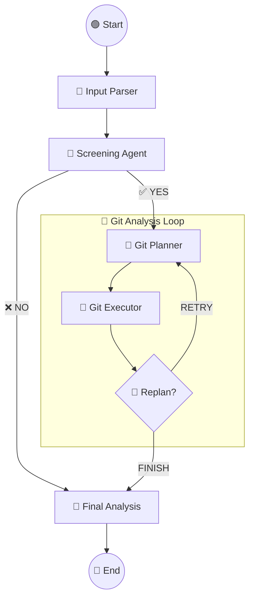

# 🤖 Multi-Agent Resume Analyzer

A sophisticated **Multi-Agent System** designed to automate the screening process. 
The system evaluates candidates by analyzing their **Resume text** and performing a deep-dive technical audit of their **GitHub repositories**.

## 🚀 Overview

This project uses **LangGraph** to orchestrate a team of AI agents that work together to:
1.  **Parse** the candidate's resume and extract GitHub links.
2.  **Screen** the resume against a specific Job Description (JD).
3.  **Audit** the candidate's code by planning and executing a real-time inspection of their public repositories.
4.  **Generate** a final score and a detailed report (Strengths, Gaps, Profile).

## 🧠 Architecture

The system is built on a **State Graph** architecture:



## ✨ Key Features

* **Resume Screening:** Automatic evaluation of candidate relevance based on configurable job descriptions for various technical roles.
* **Deep Code Analysis:** The agents don't just look at the repo name; they fetch file structures, read `README.md`, check dependency files, and analyze actual code across 15+ programming languages.
* **Self-Correcting Loop:** If the initial analysis is insufficient, the agents "Replan" and visit another repository.
* **Fail-Safe UI:** A robust Frontend that handles real-time updates and ensures the final report is always displayed.

## 🛠️ Tech Stack

* **Backend:** Python 3.12+, FastAPI, Uvicorn.
* **AI/Orchestration:** LangChain, LangGraph, OpenAI (GPT-4o / GPT-5-mini).
* **Frontend:** Vanilla JavaScript, HTML5, CSS3 (Dark Mode).
* **Deployment:** Ready for Render / Railway.

## 📦 Installation & Setup

1. **Clone the repository:**
```bash
git clone https://github.com/YoniAfek1/Skill-trace.git
cd Skill-trace

```


2. **Create a virtual environment:**
```bash
python -m venv venv
source venv/bin/activate  # On Windows: venv\Scripts\activate

```


3. **Install dependencies:**
```bash
pip install -r requirements.txt

```


4. **Set up Environment Variables:**
Create a `.env` file in the root directory:
```env
LLM_API_KEY=your_api_key_here
GITHUB_TOKEN=your_github_token_here

```


5. **Run the Server:**
```bash
uvicorn app.main:app --reload

```


6. **Open the App:**
Navigate to `http://localhost:8000` in your browser.

## 🧪 How to Use the App

### UI flow
1. Open `http://localhost:8000`.
2. Select a job role from the dropdown.
3. Paste the candidate resume text (including a GitHub profile/repo URL if available).
4. Click **Run Agent**.
5. Review:
   - **Competency Report** (final response)
   - **Agent Steps (Full Trace)** with module, prompt, and response per step

Pasteable UI example:
```text
MSc Data Science student at Technion
Analytical MSc student motivated by tackling complex problems in Machine Learning and Natural Language Processing, seeking
opportunities to contribute to impactful research while further develop technical and analytical skills.
https://github.com/shaniangel
EDUCATION
MSc in Data Science
Technion - Israel Institute of Technology
10/2025 - Present,
BSc in Data Science and Engineering - GPA 88.5
Technion - Israel Institute of Technology
10/2021 - 10/2025,
Machine Learning Deep Learning
NLP, NLP Seminar, Language,
Computation and Cognition
Statistics 1,2
Project in ML (VLMs) Computer Vision in medicine
WORK EXPERIENCE
Data Scientist
AI Solutions Group, Intel
06/2025 - Present,
Design AI-driven solutions for chip validation, leveraging tabular
modeling alongside LLM-based pipelines.
Build an end-to-end anomaly detection system, improve existing
solutions and incorporate LLM-based solutions.
Analyze and present recent research papers in internal technical
forums, contributing to architecture decisions and best practices.
AI Product Analyst
AI Solutions Group, Intel
06/2024 - 06/2025,
Evaluate ML models alongside data science and engineering teams,
focusing on performance, reliability, and practical deployment
constraints.
Partner with customers to scope data-driven, high-value use cases,
bridging product requirements and technical implementation.
Project Manager
Python
Numpy, Pandas, Sklearn, Pyspark, Pytorch
SQL Java C
Excellent Interpersonal skills
ACADEMIC PROJECTS
Evaluating Temporal Reasoning in VLMs
Adapted natural language inference to the visual
domain to evaluate temporal reasoning and plausibility
judgments in Vision Language Models.
Constructed a custom multi-style image dataset and
benchmarked multiple VLMs to analyze reasoning
behaviour and systematic biases.
Retrieval-Augmented Generation (RAG) for
Terms and Conditions
Implemented a RAG-based system to enhance
accessibility of terms and conditions documents.
Evaluated multiple chunking methods and enhancing
features.
CERTIFICATES
Dean's Excellence Award
Spring 2025 Semester
Dean's Excellence Award
Winter 2024/2025 Semester
Dean's Excellence Award
Winter 2023/2024 Semester
Certificate of Excellence - Intelligence
Department, IDF
LANGUAGES
English (Born and raised in South Africa)
Native or Bilingual Proficiency
Hebrew
Native or Bilingual Proficiency
INTERESTS
Fitness Books Travel Foodie
```

### API usage
Note (Windows PowerShell): use `curl.exe` (not `curl`) because `curl` is an alias to `Invoke-WebRequest`.
Line breaks: in the UI, paste normal multiline text; in API JSON payloads, represent new lines as `\n` inside the `prompt` string.

#### 1) Team info
```bash
curl.exe http://localhost:8000/api/team_info
```

#### 2) Agent info
```bash
curl.exe http://localhost:8000/api/agent_info
```

#### 3) Model architecture image
```bash
curl.exe -o architecture.png http://localhost:8000/api/model_architecture
```

#### 4) Execute
For API tools (Bruno/Postman etc.), see valid JSON prompt templates (use escaped newlines) in:
- `GET /api/agent_info`

For running from PowerShell:
```powershell
$body = @{
  prompt = @"
Job Role: <Insert one of /api/job_roles>
<Paste the full candidate resume text, including GitHub URL>
"@
} | ConvertTo-Json -Compress

$response = Invoke-RestMethod -Method Post -Uri "http://localhost:8000/api/execute" -ContentType "application/json" -Body $body

Useful shortcuts to view results:       
$response.response   # final response only
$response.steps | ConvertTo-Json -Depth 100 # steps array 
$response | ConvertTo-Json -Depth 100  # see full response                                                                                                                                                                                                                                                                                                                                                                                                                                      

```
Notes:
In raw JSON (Bruno/Postman), new lines must be escaped as `\n`.

In PowerShell here-strings, write real line breaks (do not type literal `\n`).

#### Optional: streaming mode for live step updates (UX purposes)
`POST /api/execute/stream` streams Server-Sent Events (SSE) for UI progress (`step`, `done`, `error` events).
